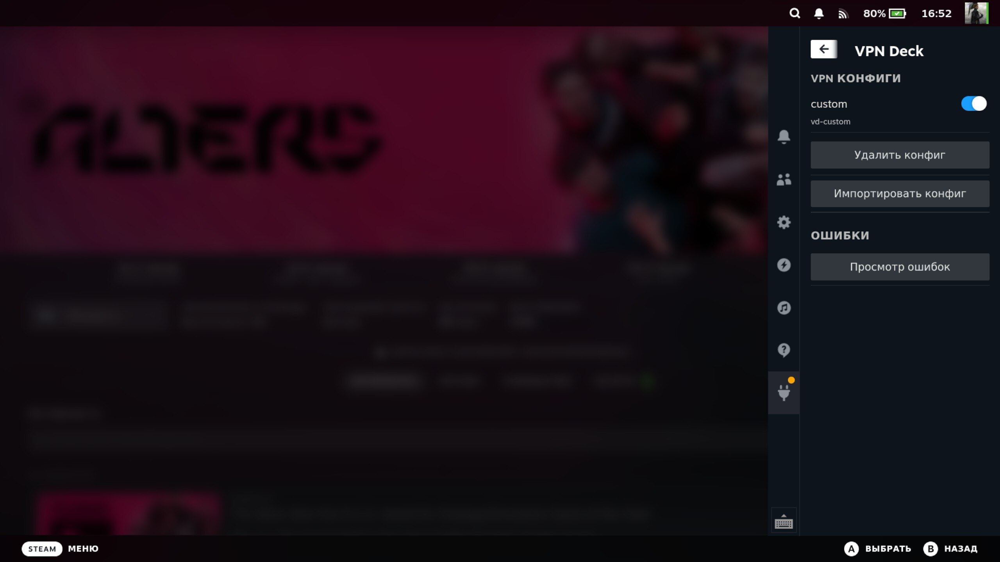

# VPN Deck

[Русский](README.ru.md)

A Decky Loader plugin for managing AmneziaWG VPN connections on Steam Deck from gaming mode UI.

## Disclaimer

**Limitation of liability:** this plugin is a technical tool for managing network configurations (AmneziaWG/WireGuard configs). Use it at your own risk. You are solely responsible for compliance with the laws of your country or region. The developer does not encourage any violation of laws and is not responsible for how or why the plugin is used.

This plugin was developed purely out of enthusiasm, in spare time. If you encounter issues, please open a detailed issue on [GitHub](https://github.com/mrwaip/vpn-deck/issues): describe the steps to reproduce, plugin and system version, and attach logs if necessary.

## 📋 Description

**VPN Deck** is a Decky Loader plugin that lets you manage VPN via AmneziaWG directly from Steam Deck gaming mode:

- Config import — add VPN from a `.conf` file through the plugin UI
- Multiple configs — store and switch between multiple VPN connections
- Enable/disable each config with a single toggle
- Real-time connection status
- Error history with the ability to clear it

The plugin requires root access to work with `awg-quick` and network interfaces.

### ⚠️ Important: Limitations

**In version 2, the plugin does not manage the `awg0` interface.** Only configs added through the plugin are managed (interfaces named `vd-<name>`).

Configs imported through the plugin are stored in `~/.local/share/vpn-deck/configs`; symlinks are created in `/etc/amnezia/amneziawg/`. AmneziaWG binaries are included in the plugin release — no separate installation required.

## Changes between v1 and v2

| | v1 | v2 |
|---|----|----|
| **Interface** | Managed only one `awg0` interface via `systemctl` | Does **not** manage `awg0`. Only configs added through the plugin (`vd-*` interfaces) |
| **Setup** | Config had to be set up manually in Desktop Mode (building amneziawg-go/awg-quick, creating `awg0.conf`, symlinks) | Configs are imported from UI (`.conf` file). Binaries are included in the release |
| **Configs** | One config (`awg0`) | Multiple configs named `vd-<name>` |

If you were using v1 with `awg0`, after upgrading to v2 the plugin will no longer bring up or stop that interface. To manage VPN through the plugin, re-import your config via "Import config".

## 📥 Installation

Install the plugin **only from official releases** on GitHub.

> [!IMPORTANT]
> **The plugin requires an AmneziaWG v1 config.** AmneziaWG v2 protocol is not supported.
> The config must be in **AmneziaWG native format** (a WireGuard-like `.conf` file with `Jc`, `Jmin`, `Jmax`, etc. fields). In the AmneziaVPN app, make sure to select **"AmneziaWG native format"** when exporting — it is not the default.

**Before removing the plugin or installing a new version, turn off VPN in the plugin itself** (set the toggle next to the active config to "off"). Otherwise, the update or removal may fail.

1. Open [Releases](https://github.com/mrwaip/vpn-deck/releases) and download the latest release (`vpn-deck-v*.zip`).
2. Copy the ZIP to your Steam Deck, open Decky Loader → plugin settings → "Install plugin" → specify the path to the file.

**After installation:** open the plugin in gaming mode → "Import config" → select a `.conf` file (e.g., from the Downloads folder). After import, the config will appear in the list and can be toggled on/off.

### How to transfer a config to Steam Deck

You need to transfer the `.conf` file to the Deck in order to select it in the plugin:

- **LocalSend** — install the app on your phone/PC and on the Deck (from Discover in Desktop Mode). Send the `.conf` file to the Deck; it will land in Downloads.
- **Desktop Mode + browser** — switch to Desktop Mode, open a browser, download the config (or save it from email/messenger) to the Downloads folder. In gaming mode, specify the path to this file in the plugin (e.g., `/home/deck/Downloads/name.conf`).

## Usage

- **Import config** — "Import config" button, select a `.conf` file. Config name: up to 12 characters (letters, digits, `_`, `=`, `+`, `.`, `-`).
- **Enable/disable** — toggle next to the config name.
- **Delete config** — "Delete config" under the desired config (the interface will be stopped).
- **Errors** — "Errors" section: view history and clear it with "Clear error history".

## Support & License

For issues or questions — [open an issue on GitHub](https://github.com/mrwaip/vpn-deck/issues). License: BSD-3-Clause.
