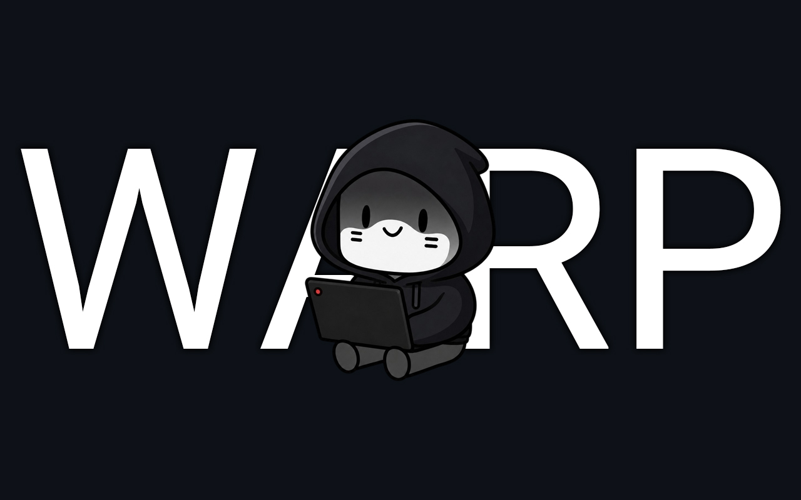

# WARP Deck

[English](README.md) | [Русский](README.ru.md) | [Українська](README.uk.md) | [简体中文](README.zh-CN.md) | [繁體中文](README.zh-TW.md) | [العربية](README.ar.md) | [فارسی](README.fa.md) | [Türkçe](README.tr.md)

Плагін для Decky Loader на Steam Deck, який дозволяє в один клік підключитися до Cloudflare WARP через AmneziaWG (протокол WireGuard із захистом від блокувань DPI), або імпортувати власні конфігурації AmneziaWG/WireGuard.

> **Примітка:** Для коректної роботи плагіна на вашому пристрої має бути обов'язково встановлений офіційний клієнт [Amnezia VPN](https://github.com/amnezia-vpn/amnezia-client).

## 📋 Можливості

- **Cloudflare WARP в один клік**: Автоматична генерація та оновлення готового конфігу WARP прямо з інтерфейсу плагіна без ручного налаштування.
- **Обхід блокувань (AmneziaWG)**: Вбудована підтримка заголовків обфускації та шумових пакетів (junk packets) AmneziaWG для обходу DPI блокувань провайдерів.
- **Імпорт власних конфігів**: Можливість завантажити будь-який файл `.conf` (AmneziaWG або стандартний WireGuard).
- **Діагностика зв'язку**: Вбудована перевірка доступності хостів (1.1.1.1, Google та RuTracker).
- **Кілька профілів**: Зручне зберігання та перемикання між різними конфігураціями.
- **Все включено**: Усі необхідні бінарники AmneziaWG постачаються разом із плагіном і не потребують окремого встановлення.

> [!IMPORTANT]
> Вбудований генератор Cloudflare WARP автоматично налаштовує всі параметри обходу DPI (включаючи сигнатуру QUIC `I1`). Однак, якщо ви імпортуєте **сторонні VPN-профили**, їх рекомендується експортувати з офіційного додатка [Amnezia VPN Client](https://github.com/amnezia-vpn/amnezia-client) у **«нативному форматі AmneziaWG»** (файл `.conf` із параметрами `Jc`, `Jmin`, `Jmax`) для гарантованого обходу блокувань.

## 📥 Встановлення

1. Завантажте останню версію (`warp-deck.zip`) з розділу [Releases](https://github.com/rosakodu/warp-deck/releases).
2. Скопіюйте ZIP-файл на ваш Steam Deck.
3. Увімкніть **Режим розробника** в налаштуваннях Steam, потім у налаштуваннях Decky Loader увімкніть **Developer mode** та оберіть "Install plugin from file" (або просто завантажте/перетягніть ZIP-файл).

## 🚀 Як використовувати

### 1. Генерація Cloudflare WARP (Рекомендовано)
Після встановлення відкрийте меню плагіна та натисніть **«Оновити» (Update)** (або плагін автоматично створить профіль `warp-deck` при першому запуску). Це надішле запит до генераторів ключів Warp, створить готовий профіль із параметрами маскування AmneziaWG, і ви зможете одразу його увімкнути.

### 2. Імпорт власних конфігурацій
Натисніть **«Імпортувати конфіг» (Import config)** та виберіть будь-який файл `.conf` на вашому пристрої (наприклад, з `/home/deck/Downloads/`).

## ⚙️ Як це працює
Плагін зберігає імпортовані конфігурації в `~/.local/share/warp-deck/configs` і створює символічні посилання в `/etc/amnezia/amneziawg/`. VPN-з'єднання запускаються за допомогою модифікованого скрипта `awg-quick`, який входить до комплекту плагіна.

## ⚖️ Ліцензія та Подяки
Базується на оригінальному плагіні [vpn-deck](https://github.com/mrwaip/vpn-deck) від mrwaip.
Цей форк ліцензований на умовах ліцензії BSD-3-Clause.
